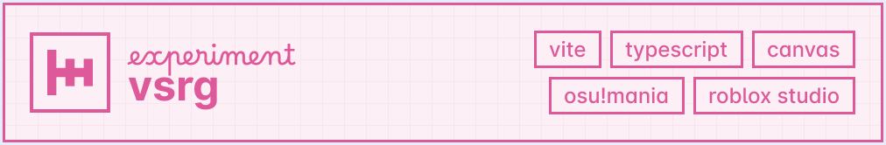

## 📄 about

vsrg (named after the acronym for **v**ertical **s**crolling **r**hythm **g**ames) is a tool for viewing and converting osu!mania beatmaps to roblox-readable modulescripts. ironically enough, it's not an actual vsrg.

this was made for a RoFNF project a friend of mine wanted to make, but ended up cancelling. since that project didn't develop any further, this tool was also abandoned for a while.

some slight enhancements have been made compared to the version made back then, to improve usability and visualization, but it's still quite old and rushed. you probably wouldn't want to use this as actual tooling, but it's been open-sourced to serve as a neat little hacky experiment to study.

## ▶️ running

you need a standalone javascript runtime (i used [bun](https://bun.sh/) for this). just install dependencies at the project root, then execute the `dev` vite task.

with bun, this would consist of running `bun install` then `bun run dev`. it should open a localhost server at 5173, which you can access to use vsrg.

after opening, just feed it an .osz file and select a difficulty to convert. you can also click play on the audio track element to visualize it in-app.

## ⚠️ limitations

- 🔥 rushed code that's been taped together
- ⏱️ visualizer does not support speed or bpm changes
- 🎹 no actual keypresses are registered, it's only time-triggered flashing lights
- 🎨 hardcoded note color palette that will crash the app if you try any map beyond 7K
- 🔊 weird and inconsistent audio synchronization, but you can adjust the offset ig
- 🐌 chart is tied to the audio player's timer which has a very limited tick rate
  - ℹ️ the renderer does interpolate hit objects for better visuals, but that won't help mitigate audio latency regardless
- 💣 pretty sure it memory leaks after loading many different maps because of the blob URLs it creates when loading in audio files
